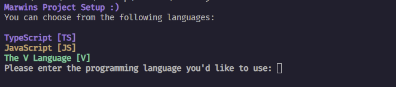

<!-- Display the CL-Pic.png  image in /images-->

# Marwin's Project Setup Application

A simple project setup application written in the V Programming Language.

> [!IMPORTANT]
> Supported languages: 
> TypeScript 
> JavaScript 
> The V Programming Language